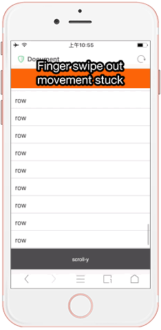
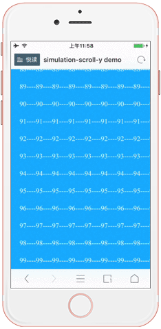
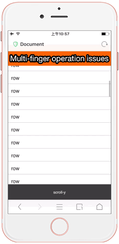
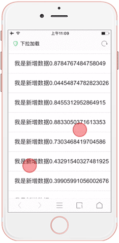
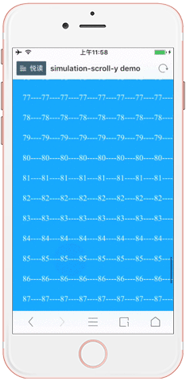
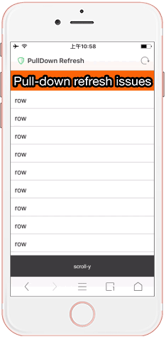

## simulation-scroll-y.js

#### Overview

Vertical scroll simulation solution on mobile device.

#### Installation

```
npm install --save simulation-scroll-y
```

`simulation-scroll-y` released as a `umd` module. You can use it in any way for your favorite. You can get global variable `simulationScrollY` by serving as `<script>` tag.

#### Getting Started

```html
<div id="box">
    <div id="scroll-box">

    </div>
</div>

<!-- Import finger-mover -->
<script src="finger-mover.js"></script>
<!-- Import simulation-scroll-y -->
<script src="simulation-scroll-y.js"></script>
<script>
    var fm = new Fmover({
        el: '#scroll-box',
        plugins: [
            simulationScrollY()
        ]
    })
</script>
```

The above code will implement a simple vertical simulation scrolling.

* <a href="https://fmover.hcysun.me/example/demo/simulation-y-demo.html" target="_blank">Substantially vertical scrolling simulation live demo</a>


#### Features

* Just 4KB after compression

* Scrolling element movement is not affected when multi-finger touch, the scrolling convergence very smooth powered by [Fingerd](/package/fingerd)

* Scrolling element movement is not affected when finger swipe out the screen edge. Scrolling element movement will be stuck when finger swipe out the screen edge on many browsers in a mostly open-source solution.

* Scalable custom pull-down refresh

* Load more

* 2D scrolling implemention with [simulation-scroll-x.js](/plugins/simulation-scroll-x) plugin

* Scroll bar

#### Compared with Existing Solutions

There are many scroll simulation lib on mobile device, such as: iscroll, xscroll, better-scroll and so on. Why do you should be know to `simulation-scroll-y`？The following are its characteristics compared with others:

###### 1. Smaller file size

The file size is very large in a mostly scroll simulation library, simulation-scroll-y is the smallest one.

simulation-scroll-y as a plug-in for finger-mover, the file size just 4.42KB and the total size of finger-mover (11.12KB) and simulation-scroll-y are just 15.54KB. In addition, finger-mover also provides other plugins for you.

If you want to simulate scroll and load more, to use simulation-scroll-y instead of iscroll will be save file loading size for you. If you want to implement slide show effect, try to use finger-mover plugin instead of swiper.

###### 2. Scrolling element movement will be stopped when finger swipe out the screen edge in some browsers on the iOS

This problem arises in the UC browser and Tencent™ QQ embed browser.

Screenshot:



By using `simulation-scroll-y` to solve this problem:



###### 3. Multi-finger operation problem

Scrolling element movement will be stopped when multi-finger touch the screen in a mostly open-source libraries, like this:



Or other problems, like this:

Though the scrolling element movement normally when the second finger touch the screen, but it will be stopped when the first finger removed in this case. If touch the screen with the first finger again when the second finger scrolling, the screen display will be like this:



`simulation-scroll-y` has solved this problem with no matter a few fingers. `simulation-scroll-y` will give control premission to the first finger, if the first finger to lift, then the second finger will inherit the first finger of the state, that's convergence scrolling perfect powerd by [Fingerd](/package/fingerd).

Screenshot:



###### 4. Pull-down refresh problem

Pull down refresh will be working normally when repeat pull down and pull up action quickly in some other libraries, like this:



Some library defined the type of pull down refresh: waiting or not after pull down.

`simulation-scroll-y` allows you to customize the pull-down action and that not affect scrolling element. Reference `pullDown` option.

#### Options

###### scrollBar

* Type: `Boolean`

* Default:`true`

* Description:

    Specifies the display scroll bar.

###### bounce

* Type: `Boolean`

* Default:`true`

* Description:

    Specifies the boundary elasticity.

###### pullDown

* Type: `Object`

* Default:

    ```js
    {
        use: false,
        distance: 50,
        onBegin: function(currentY){},
        onActive: function(){},
        onAfter: function(currentY){}
    }
    ```

* Description:

    Pull-down refresh configuration

    ```js
    {
        // Specifies the pull-down, default disable
        use: false,
        // Specifies the pull-down distance, reaching this distance will be triggers a pull-down action (onActive event)
        distance: 50,
        // Continuously trigger between start pull-down and onActive event just triggerd and pass the position coordinates of scrolling element as parameter
        onBegin: function(currentY){},
        // Trigger when pull-down distance greater than config value
        onActive: function(){},
        // Trigger onAfter event in following case:
        // 1. Continuously trigger when scrolling element retraction if pull-down distance less than config distance.
        // 2.  Continuously trigger when scrolling element retraction on calling function this.refresh().
        // Trigger onAfterevent will pass the position coordinates of scrolling element as parameter.
        onAfter: function(currentY){}
    }
    ```

    <p class="tip">
    Note that the `this` of event function `onBegin`, `onActive` and `onAfter` is point to the plug-in instance object.
    </p>

* Example:

    `simulation-scroll-y` allows you to customize the pull-down action.

    Suppose we have the following DOM structure:

    ```html
    <div id="box">
        <div id="scroll-box">
            <div class="pull-down-dom">Pull-down refresh</div>

            <div class="content">Next 100 li elements</div>
        </div>
    </div>
    ```

    Implement pull-down refresh by following JavaScript code:

    ```js
    <script src="finger-mover.js"></script>
    <script src="simulation-scroll-y.js"></script>
    <script>
    // Get pull-down DOM
    var pullDownDom = document.querySelector('.pull-down-dom')
    var fm = new Fmover({
        el: '#scroll-box',
        plugins: [
            simulationScrollY({
                pullDown: {
                    use: true,
                    distance: 50,
                    onBegin: function (currentY) {
                        // Calculate the pull-down percentage by currentY
                        var proportion = parseInt(currentY / 50 * 100)

                        if (proportion >= 100) {
                            proportion = 100
                            pullDownDom.innerHTML = 'Release to loading'
                        } else {
                            pullDownDom.innerHTML = proportion + '%'
                        }

                    },
                    onActive: function () {
                        var that = this
                        pullDownDom.innerHTML = 'Loading...'

                        // Simulate sending network requests
                        setTimeout(function () {
                            // Calling function refresh() after request data successful
                            that.refresh(function () {
                                console.log('Done')
                                pullDownDom.innerHTML = 'Pull-down refresh'
                            })
                        }, 2000)
                    },
                    onAfter: function (currentY) {
                        if (currentY < 50) {
                            pullDownDom.innerHTML = 'Pull-down refresh'
                        }
                    }
                }
            })
        ]
    })
    </script>
    ```

    <p class="tip">
        Note that you must do update operations in the refresh() callback function after data requests successful.
    </p>

    ```js
    this.refresh(function () {
        console.log('Done')
    })
    ```

    * <a href="https://fmover.hcysun.me/example/demo/pull-down-demo.html" target="_blank">Pull-down refresh live demo</a>

    

###### loadMore

* Type: `Object`

* Default:

    ```js
    {
        distance: 0,
        onLoadMore: function(){}
    }
    ```

* Description:

    Loading more

    ```js
    {
        // The distance represents the distance from the screen bottom and default value is 0. Trigger onLoadMore event when scrolling to the screen bottom.
        distance: 0,
        // Trigger when distance great than the distance from the screen bottom and scrolling element.
        onLoadMore: function(){}
    }
    ```

    <p class="tip">Note that the `this` of event function `onLoadMore` is point to the plug-in instance object.</p>

* Example:

    `loadMore` allows you to customize the action same as pull-down refresh. Suppose we have the following DOM structure:

    ```html
    <div id="box">
        <div id="scroll-box">
            <div class="content"></div>

            <div class="load-more">Loading more</div>
        </div>
    </div>
    ```

    Implement loading more refresh by following JavaScript code:

    ```
    <script src="finger-mover.js"></script>
    <script src="simulation-scroll-y.js"></script>
    <script>
    // Get loading more DOM
    var loadMoreDom = document.querySelector('.load-more')
    var fm = new Fmover({
        el: '#scroll-box',
        plugins: [
            simulationScrollY({
                loadMore: {
                    distance: 0,
                    onLoadMore: function () {
                        var that = this
                        loadMoreDom.innerHTML = 'Loading...'

                        // Simulate sending network requests
                        setTimeout(function () {
                            loadMoreDom.innerHTML = 'Loading more'
                            // Loading more by calling loadEnd() method
                            that.loadEnd()
                        }, 2000)
                    }

                }
            })
      ]
    })
    </script>
    ```

    <p class="tip">
    Note that you should be calling `fm.loadEnd()` method to reset loading more after data requests successful.
    </p>

#### Options/Event

<p class="tip">
    Note that the scope of the callback function for the following event option is the plug-in instance object.
</p>

###### onTouchMove

* Type: `Function`

* Description:

    Continuously trigger when finger drag the scroll element to scroll and pass the current position coordinates to the callback function.

* Example:

    ```js
    var fm = new Fmover({
        el: '#scroll-box',
        plugins: [
            simulationScrollY({
                onTouchMove: function (currentY) {
                    console.log(currentY)
                }
            })
        ]
    })
    ```

###### onTransMove

* Type: `Function`

* Description:

    Continuously trigger whe inertial scrolling and pass the current position coordinates to the callback function.

* Example:

    ```js
    var fm = new Fmover({
        el: '#scroll-box',
        plugins: [
            simulationScrollY({
                onTransMove: function (currentY) {
                    console.log(currentY)
                }
            })
        ]
    })
    ```

###### onTransMoveEnd

* Type: `Function`

* Description:

    Trigger when inertial scrolling stopped and pass the current position coordinates to the callback function.

* Example:

    ```js
    var fm = new Fmover({
        el: '#scroll-box',
        plugins: [
            simulationScrollY({
                onTransMoveEnd: function (currentY) {
                    console.log(currentY)
                }
            })
        ]
    })
    ```

#### Instance Method

###### scrollTo(target, time, limit)

* Description:

    Scroll to target point.

* Parameters:

    * `{Number | Element | String} target` Scroll to the target point, target element or target element selector.
    * `{Number} time` The time of scrolling: milliseconds
    * `{Boolean} limit` Specifies the edge restrictions. Default value is false. Scroll elements to any location without edge restrictions by `scrollTo` method after enabled.

* Example:

    ```js
    var fm = new Fmover({
        el: '#scroll-box',
        plugins: [
            simulationScrollY()
        ]
    })

    // Scroll to the position -300px in 1 second.
    fm[0].scrollTo(-300, 1000)
    ```

    Scroll to the target point immediately by set time to 0.

    ```js
    fm[0].scrollTo(-300, 0)
    ```

    The method scrollTo support that scrolling by given DOM element in addition to setting the digital target points directly. You can use the DOM element or the CSS selector of the element as the first parameter.

    ```js
    let p = document.querySelector('p')
    fm[0].scrollTo(p, 1000)
    // or
    fm[0].scrpllTo('.wrap', 1000)
    ```

    * <a href="https://fmover.hcysun.me/example/demo/scroll-to-y.html" target="_blank">Scroll to the target point live demo</a>

    

###### loadEnd()

* Description:

    Reset loading more

    In order to prevent the last network request doesn't completed cause the repeated trigger, `simulation-scroll-y` will be lock the event after loading more (`onLoadMore` event has been triggered), so you need to calling this method to reset loading more after network request successful. In addition, the `loadEnd` method will recalculate the scroll size.


###### refresh(callBack)

* Description:

    You should refresh data in `callBack` after pull-down refresh, because use may be scrolled the page when refresh data processing after pull-down refresh. The actual data refresh operation should be after user's operation has been stopped. `callBack` handle this situation by buffering mechanism. That's the difference between `refresh` and `loadEnd`.

    The `refresh` method will recalculate the scroll size.

* Parameters:

    * `{Function} callBack` Callback function of the refresh

###### refreshSize()

* Description:

    Recalculate the size of scrolling elements, scroll restrictions and so on.

    Since `refresh` and ` loadEnd` method have included recalculate the size automatically, so we needn't calling `refreshSize` in most cases.

#### demo List

Reference [full demo]() to get more demo powerd by `simulation-scroll-y` plugin.


